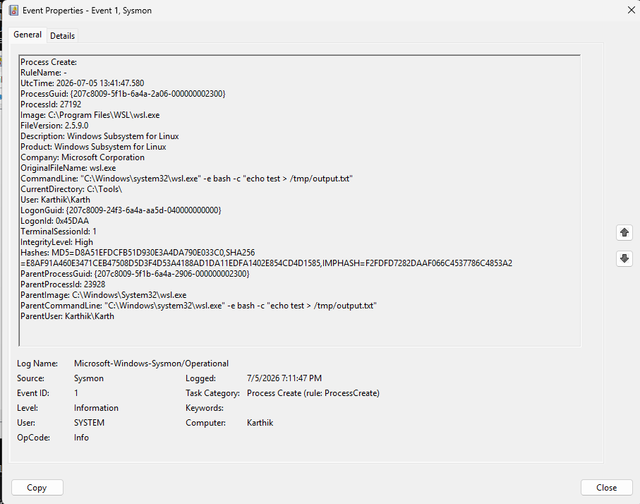

# 🔍 Threat Detection Research
### Offensive TTPs → High-Fidelity Detections | SigmaHQ Contributor

> *"Effective detection engineering starts with understanding the attack lifecycle."*

This repository documents offensive security research translated into actionable detection logic. Each project includes the attack methodology, Sigma rule, SIEM translations, and validation evidence.

---

## 🎯 Project: WSL-Based EDR Evasion Detection

### 🔴 Offensive Context
**Technique**: Adversaries abuse Windows Subsystem for Linux (WSL) to execute Linux-native payloads outside Windows user-mode EDR hooks.  
**Why it works**: WSL2 runs in a lightweight utility VM. Many EDR agents only hook Win32 APIs, leaving Linux binary execution inside WSL poorly monitored.  
**Real-world usage**: Red Teams leverage this to stage C2 frameworks (Sliver, Havoc), run LOLBins (chisel, nmap), or exfiltrate data via Linux pipes.

**MITRE ATT&CK**:  
- [T1202: Indirect Command Execution](https://attack.mitre.org/techniques/T1202/)  
- [T1059.004: Unix Shell](https://attack.mitre.org/techniques/T1059/004/)

---

### 🔵 Defensive Implementation
**Rule**: `proc_creation_wsl_suspicious_exec.yml`  
**Status**: ✅ Submitted to [SigmaHQ/sigma](https://github.com/SigmaHQ/sigma)  
**Log Source**: Windows Sysmon Event ID 1 (Process Creation)

**Detection Logic**:
```yaml
detection:
    selection_img:
        Image|endswith: '\wsl.exe'
        OriginalFileName: 'wsl.exe'
    selection_cli_exec:
        CommandLine|contains:
            - '-e '
            - '--exec '
            - 'bash -c'
            - 'sh -c'
    selection_cli_paths:
        CommandLine|contains:
            - '\AppData\Local\Temp\'
            - '\Users\Public\'
            - '/tmp/'
            - '/dev/shm/'
    condition: all of selection_*
```

---


### 🧪 Validation & Evidence
- ✅ `sigma check` passed: 0 errors, 0 issues
- ✅ Simulated execution: `wsl.exe -e bash -c "echo test > /tmp/output.txt"`
- ✅ Sysmon Event ID 1 captured with matching `Image`, `CommandLine`, and path indicators

📸 **Visual Evidence**:



*Caption: Sysmon logs the process creation of wsl.exe with suspicious CLI arguments (`-e`, `bash -c`, `/tmp/`), triggering all Sigma rule conditions.*

📄 **Full Test Report**: [`evidence/test_report.md`](evidence/test_report.md)

---

### 📚 References
- [SigmaHQ Specification](https://github.com/SigmaHQ/sigma-specification)
- [Elastic Security: WSL Living Off The Land](https://www.elastic.co/security-labs/wsl-living-off-the-land)
- [MITRE ATT&CK: T1202](https://attack.mitre.org/techniques/T1202/)
- [Sysmon Documentation](https://learn.microsoft.com/en-us/sysinternals/downloads/sysmon)

---

**Author**: Karthik G  

